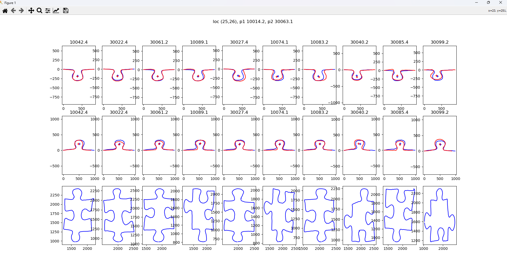

# puzzle_solver

Puzzle solver is a simple script that helps with solving puzzles. It only uses the shapes of the elements to fit them together correctly. To do this, each element should be photographed (I used the Timer Camera application for this purpose), preferably by illuminating the block from below through a diffusing layer (I used a table with a frosted glass top and a lamp placed underneath it). It is important that each photo is taken from exactly the same distance.

{width=25%}

The program then analyzes the image, extracts the contour from it, converts it into a series of vectors and calculates the course of deviations of each subsequent vector from the previous one. On this basis, it determines the position and orientation of the lock on each side and then determines the position of the corners.


In the next stage, the elements are compared to each other based on the criteria of the orientation of the lock, the length of the edges, the position of the center of the lock and finally the distance between the contours of both elements. On this basis, the program recommends the most promising candidates. 



After physically checking if the element fits, the user confirms the selection by building a puzzle map (visible in the puzzle.md file)

```txt
|    |       1 |       2 |       3 |       4 |       5 |       6 |       7 |       8 | 
|---:|--------:|--------:|--------:|--------:|--------:|--------:|--------:|--------:|-
|  1 |  1027.3 |  1026.4 |  1025.4 |  1024.4 |  1023.4 |  1022.4 |  1021.4 |  1020.4 | 
|  2 |  2001.3 | 20042.2 | 20003.3 | 30019.4 | 10061.1 | 10069.4 | 10097.3 | 30010.4 | 
|  3 |  2002.3 | 20073.3 | 10088.1 | 20084.3 | 10042.4 | 20017.1 | 10073.4 | 20002.1 | 
|  4 |  2003.3 | 10050.1 | 30087.1 | 20090.4 | 10071.1 | 10045.4 | 30064.1 | 10032.2 | 
|  5 |  2004.3 | 10084.4 | 30050.4 | 10057.1 | 10034.2 | 20099.1 | 30006.2 | 10055.1 | 
|  6 |  2005.3 | 30008.3 | 30084.2 | 10026.2 | 20037.3 | 30020.1 | 20079.2 |    -1   | 
|  7 |  2006.3 | 20024.3 | 10083.1 | 10087.3 | 30099.1 | 10091.2 | 20011.1 |    -1   | 
|  8 |  2007.3 | 20055.3 | 20047.2 | 20014.1 | 10051.4 | 40003.1 |    -1   |    -1   | 
|  9 |  2008.3 | 20005.4 | 30009.1 | 30041.4 | 20026.3 |    -1   |    -1   |    -1   | 
| 10 |  2009.3 | 30047.3 | 20025.3 | 30075.3 | 30080.4 |    -1   |    -1   |    -1   | 
| 11 |  2010.3 | 20072.3 | 20050.2 | 10017.3 | 30024.3 |    -1   |    -1   |    -1   | 
| 12 |  2011.3 | 10062.2 | 10020.3 | 30032.2 | 20069.1 |    -1   |    -1   |    -1   | 
| 13 |  2012.3 | 20019.4 | 30074.1 | 30045.3 |    -1   |    -1   |    -1   |    -1   | 
| 14 |  2013.3 | 30013.1 | 30073.4 | 20041.3 |    -1   |    -1   |    -1   |    -1   | 
| 15 |  2014.3 | 30066.4 |    -1   |    -1   |    -1   |    -1   |    -1   |    -1   | 
| 16 |  2015.3 | 20038.1 |    -1   |    -1   |    -1   |    -1   |    -1   |    -1   | 
| 17 |  2016.3 | 20046.2 |    -1   |    -1   |    -1   |    -1   |    -1   |    -1   | 
| 18 |  2017.3 | 30034.4 |    -1   |    -1   |    -1   |    -1   |    -1   |    -1   | 
```

